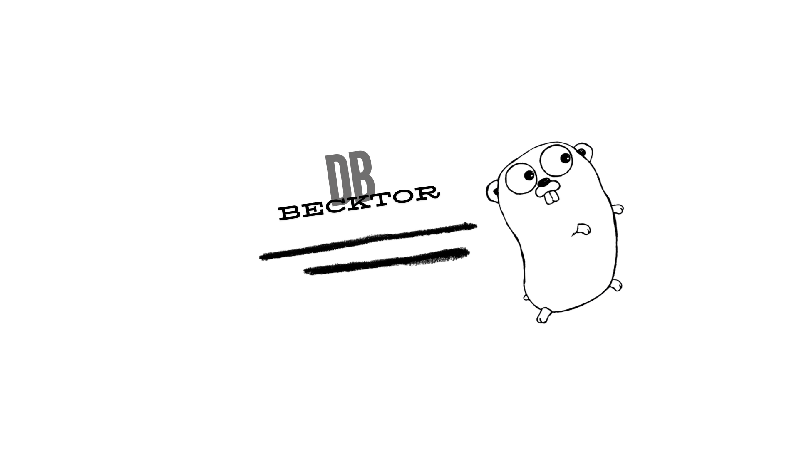

### becktordb - Vector Database


*The Go gopher was  originally designed by Renee French. Source: https://golang.org/doc/gopher*
### Features:
- Persistant storage:
    - Writes and reads binary file
- Document loader with chunking
- Embeddings service:
    - Gemini 
        - To run get GEMINI_API_KEY at [https://ai.google.dev/](https://ai.google.dev/) and set at .env
    - Bedrock 
        - To run get access keys in IAM and set in .env file and enable 'cohere.embed-english' at Bedrock AWS:
            ```
            AWS_ACCESS_KEY_ID=
            AWS_REGION=
            AWS_SECRET_ACCESS_KEY=
            ```

- Vector similarity search:
    - Cosine

## Usage examples in  `examples` directory:
Gemini:
`examples/gemini/main.go`

Bedrock:
`examples/bedrock/main.go`